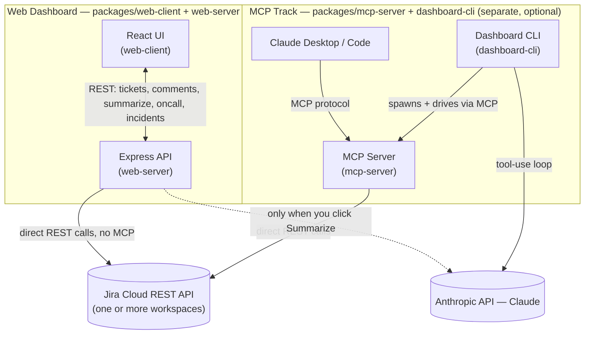
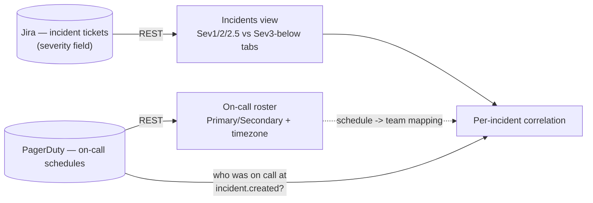
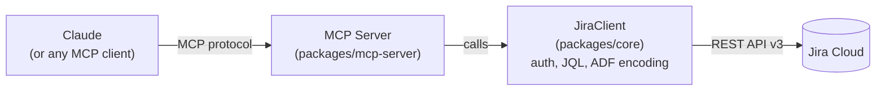

# jira-okr-dashboard-mcp

A Jira-over-MCP toolkit, built up in three stages:

1. **An MCP server** exposing Jira issues/progress as tools, for any MCP
   client (Claude Desktop, Claude Code, ...).
2. **A one-shot CLI** that drives Claude through those tools to write a
   static OKR status report.
3. **A live, multi-workspace web dashboard** — codenamed **Looking
   Glass** in the app itself — pulling tickets from several Jira
   sites/teams into one view: filter by team, project label, or sprint;
   comment on tickets without leaving the page; see whether each active
   sprint is on track to finish; and a second tab for on-call rosters and
   Jira-native incidents, correlated against who was on call when each
   one was reported. An AI-generated status summary covers whatever
   you're currently looking at, in either tab.

This is a clean-room, open-source rebuild of internal tools I built at
work — same ideas (AI-generated Jira visibility via MCP, Claude-assisted
status reporting), but every line here is new code written against my own
test Jira instance, with no proprietary code, data, or credentials
involved.

## Architecture — how the pieces fit together

Two tracks, one shared Jira brain underneath:

- **Visual track** (web dashboard) — you look at a table, filter it, click around.
- **Conversational track** (MCP) — you ask Claude a question and it goes and
  checks Jira for you, live in chat (or as a one-shot script for the CLI
  variant).

Both just call the same `JiraClient` in `packages/core` — they only differ
in how they present it, depending on whether you'd rather look or ask.
**The web dashboard never talks to MCP at all** — despite the repo's name,
MCP is only involved if you use the separate CLI/Claude-Desktop track.



- **Jira integration is always direct REST**, via the shared `JiraClient`
  in `packages/core` — both tracks use it, neither goes through the other.
- **An Anthropic API key is only needed for AI features specifically**:
  the web dashboard's Summarize button, or the CLI (which can't function
  without one, since writing the report *is* the CLI's job). Viewing
  tickets, filtering, and posting comments in the web dashboard need
  nothing but Jira credentials — zero LLM calls.
- **The MCP server is a separate, optional way to reach the same Jira
  data** from Claude Desktop or Claude Code, for people who want to ask
  Jira questions in a chat instead of a dashboard. Nothing in the web
  dashboard depends on it running.

## The web dashboard

The headline feature — titled **Looking Glass** in the browser tab and
header. As an engineering leader with a few teams, each possibly living
in a different Jira project or even a different Atlassian site, this
answers "what's actually going on across all of it" in one place, across
two tabs:

- **Tickets** — key, summary, assignee, due date, ETA, sprint, status,
  and the latest comment, tagged by team and project label, with a
  comment box and an AI summarize button
- **On-Call & Incidents** — who's on call right now (primary/secondary,
  with timezone), and Jira-native incidents correlated against who was
  on call when each one was reported

```bash
npm install
npm run setup:jira    # interactive wizard — connects to real Jira, writes config for you
npm run web-server     # terminal 1 — API on :4000
npm run web-client     # terminal 2 — UI on :5173
```

Want to see it working before touching a real Jira account? See
[`demo/README.md`](demo/README.md) — three fixture Jira servers, a
ready-made `config/workspaces.demo.json`, and instructions to run the
whole thing end to end against sample data (comment posting included).

### Connecting Jira without hand-editing JSON

`npm run setup:jira` is the fast path — an interactive wizard
([`scripts/setup-jira.mjs`](scripts/setup-jira.mjs)) that:

1. Asks for your Jira base URL, email, and an API token
2. Tests the connection immediately (fails fast with a clear error if
   something's wrong, rather than a confusing failure three steps later)
3. Lists your actual projects so you pick one instead of typing a key from memory
4. **Auto-detects your Story Points, Sprint, and ETA custom field IDs by
   name** — no more knowing what `customfield_10016` means or hunting for
   it in Jira's admin settings
5. Optionally walks through incident severity setup (severityField,
   severityValues, highSeverityValues) if this project tracks incidents
6. Writes the finished entry to `config/workspaces.json` and the token to
   `.env` — both on your own machine; nothing is sent anywhere but Jira

Run it once per team — it appends, so a second run adds a second
workspace rather than overwriting the first. Prefer to configure by hand,
or scripting your own setup? `config/workspaces.example.json` still works
exactly as before; the wizard is a faster path to the same file, not a
replacement for editing it directly.

Only `baseUrl`, `email`, and `jql` are truly required in a workspace
entry — everything else (`storyPointsField`, `etaField`, `sprintField`,
`severityField`, `severityValues`, `highSeverityValues`) is optional and
degrades gracefully when omitted (see the Sprint/Kanban and incident
sections below for what "omitted" means in each case). The wizard fills
in what it can auto-detect and skips the rest rather than guessing.

**How a workspace config works:** each entry in `config/workspaces.json`
is one Jira site + a JQL scoping which issues belong on the dashboard,
tagged with a `team` label for the UI. Multiple workspaces can point at
the *same* Jira site (different projects, same team leader owning both)
or genuinely different Atlassian sites — the aggregator doesn't care
either way, it just fetches each one and tags the results:

```json
{
  "id": "team1-platform",
  "label": "Team 1 — Platform Engineering",
  "team": "Team 1",
  "baseUrl": "https://your-team.atlassian.net",
  "email": "you@example.com",
  "apiTokenEnvVar": "JIRA_TEAM1_API_TOKEN",
  "storyPointsField": "customfield_10016",
  "etaField": "customfield_10050",
  "jql": "project = PLAT AND resolution = Unresolved ORDER BY updated DESC"
}
```

Tokens are never stored in the config file itself — `apiTokenEnvVar` names
an environment variable that holds the real secret, so the config is safe
to share with your team or check into a private repo.

One workspace being down or misconfigured doesn't blank the dashboard —
see `Aggregator.fetchAllTickets` in `packages/web-server/src/aggregator.ts`:
failures are isolated per workspace and surfaced as a banner, while every
workspace that did respond still renders.

### Sprint & Kanban awareness

Not every team works the same way — some run Scrum sprints, some run
Kanban, and a real dashboard has to represent both honestly instead of
forcing everything into one shape. Set `sprintField` on a workspace and
its tickets carry real sprint data (name, dates, goal); leave it unset
and that workspace's tickets correctly show **Kanban** instead of a
missing value — that's the deliberate signal for "this team doesn't use
sprints," not an error.

For every active/future sprint present in the current data, a **Sprint
health** panel answers the actual question a team lead has — *is this
sprint going to finish on time* — using a plain pace heuristic: progress
so far vs. time elapsed so far.

```
percent done (by points, or by issue count as fallback)
  vs.
percent of the sprint's time that's already elapsed
```

| Projection | Meaning |
|---|---|
| **On track** | Progress is keeping pace with time elapsed |
| **At risk** | Progress is lagging time elapsed by more than 15 points |
| **Will miss** | Past the sprint's own end date, still not done |
| **Completed** / **Incomplete** | Sprint is closed — did it finish everything or not |

This is deliberately a pace heuristic, not a velocity model trained on
sprint history — it's meant to answer "does this look OK at a glance,"
not produce a precise ETA. See `computeSprintProgress` in
[`packages/core/src/sprint-progress.ts`](packages/core/src/sprint-progress.ts)
for the exact math, and the demo's `SPRINT_12` / `SPRINT_8` fixtures in
[`demo/mock-jira-server.mjs`](demo/mock-jira-server.mjs) for a live
example of one at-risk and one on-track sprint side by side.

### On-call & incidents

A second tab in the web dashboard, built on a real distinction worth
stating plainly: **incidents live in Jira, on-call schedules live in
PagerDuty (or whatever you use) — this project never conflates the two.**



- **On-call roster** — current Primary/Secondary per team, each with their
  timezone, plus a short rotation preview ("next up"). Backed by a
  provider-agnostic `OnCallProvider` interface
  ([`packages/core/src/oncall/types.ts`](packages/core/src/oncall/types.ts))
  — PagerDuty is the only implementation today
  ([`pagerduty-provider.ts`](packages/core/src/oncall/pagerduty-provider.ts)),
  but VictorOps/Opsgenie are meant to be additional implementations of that
  same interface, not a rewrite of anything that calls it.
- **Incidents aren't fetched from PagerDuty at all.** They're regular Jira
  tickets from a workspace that has `severityValues` configured — an
  explicit allow-list of what counts as an incident severity (e.g.
  `["Sev1", "Sev2", "Sev2.5", "Sev3"]`), *not* "any ticket with a priority
  set." That distinction matters: Jira's Priority field defaults to
  something on nearly every ticket regardless of type, so treating
  "severity is non-null" as "this is an incident" would misclassify your
  entire backlog. `highSeverityValues` is the subset of that allow-list
  that surfaces on the prominent tab; everything else lands on "Sev3 & below."
- **Correlation, not assignment.** "Who was on call" for an incident isn't
  read off the ticket's assignee — it's computed by asking the on-call
  provider who was on call *at the incident's reported timestamp*
  (`OnCallService.enrichWithOnCall` in
  [`packages/web-server/src/oncall-service.ts`](packages/web-server/src/oncall-service.ts)).
  An incident from three weeks ago correctly shows who was on call three
  weeks ago, not whoever is on call right now.
- **On-call is entirely optional.** No `config/oncall.json`? The dashboard
  runs fine without it — the roster panel says so plainly, and incidents
  just show "Unknown" instead of a name rather than the feature failing to
  load.
- **Team and date-range filters** narrow the incidents table independently
  of the High severity / Sev3-and-below tabs — both tab counts update to
  reflect whatever's currently filtered, same pattern as the Tickets tab.

```bash
cp config/oncall.example.json config/oncall.json
# edit config/oncall.json — one PagerDuty schedule ID per team
# add PAGERDUTY_API_TOKEN to .env
```

See [`demo/README.md`](demo/README.md) for a fixture PagerDuty server with
three schedules and a couple of incidents timed to land inside specific
shifts, so correlation has something real to demonstrate without a
PagerDuty account.

## Why MCP for the server/CLI half

MCP servers are often thought of as "an abstraction layer over a service"
— Jira, Slack, GitHub, whatever. More precisely, an MCP server abstracts
*the shape of the interaction*, not the service itself. Every backend has
its own bespoke way of doing things — REST vs GraphQL, its own auth
scheme, Jira's specific JQL syntax and comment format (Atlassian Document
Format, not plain text). Without MCP, an AI client needs custom code for
every single one. MCP standardizes the outer interface — list tools, call
a tool, get a structured result — so the client only has to speak that
once, and any compliant server plugs in the same way underneath.

In this project, that server sits above exactly one thing — **Jira**,
via our own `JiraClient` — not a multi-service gateway abstracting Jira
*and* Slack *and* GitHub behind one endpoint:



That's the more common MCP pattern, and the one this repo follows: small,
single-purpose servers rather than one server that knows about
everything. Want Slack or GitHub too? That's a separate MCP server each,
not more code added to this one — an MCP client like Claude Desktop just
connects to several of them at once.

The tools in `packages/mcp-server/src/tools/` don't know or care who's
calling them. Point Claude Desktop or Claude Code at
`packages/mcp-server/src/server.ts` and you get the same three tools
interactively, ask-a-question style, no dashboard needed:

- **`search_issues`** — run a JQL query, get back normalized issue summaries
- **`get_issue`** — fetch one issue by key
- **`get_okr_progress`** — run a JQL scoped to one OKR (an epic or a label)
  and compute completion by issue count, and by story points when every
  matched issue is estimated

`packages/dashboard-cli` is one more MCP client on top of that — useful
when you want a single static report to drop in Slack or a wiki page,
generated by an agentic loop where Claude decides which tools to call and
when it has enough to write the report:

```bash
cp .env.example .env
# fill in JIRA_BASE_URL, JIRA_EMAIL, JIRA_API_TOKEN, ANTHROPIC_API_KEY, OKR_JQL
npm run mcp-server   # for Claude Desktop/Code — see examples/claude_desktop_config.json
npm run dashboard     # one-shot: writes ./dashboard.html
```

Story points and ETA live in custom fields whose IDs vary per Jira
instance/plan — `JIRA_STORY_POINTS_FIELD` / `JIRA_ETA_FIELD` (single-
workspace) or each workspace's `storyPointsField`/`etaField`
(multi-workspace) let you point at the right one. Find yours via
`GET /rest/api/3/field` if a value you know is set keeps coming back null.

## Project layout

```
packages/
  core/                       Shared JiraClient, types, workspace config loader — everything else depends on this
    src/jira-client.ts         Jira Cloud REST client (native fetch, no deps)
    src/workspaces.ts          Multi-workspace config loading + validation
    src/adf.ts                 Atlassian Document Format <-> plain text (comments)
    src/sprint-progress.ts      Groups tickets by sprint, computes the on-track/at-risk/will-miss projection
    src/incidents.ts            Filters tickets to incidents, classifies high/lower severity
    src/oncall/                 OnCallProvider interface + PagerDutyProvider + config loader
  mcp-server/                 MCP server: search_issues, get_issue, get_okr_progress
  dashboard-cli/               One-shot CLI: MCP client + Claude tool-use loop -> static dashboard.html
  web-server/                  Express API: multi-workspace aggregation, comment posting, AI summarize
    src/aggregator.ts           Parallel fetch across workspaces with per-workspace error isolation
    src/oncall-service.ts        Schedule-id -> team mapping, on-call roster, per-incident correlation
    src/routes/                 tickets.ts, comments.ts, summarize.ts, oncall.ts, incidents.ts
  web-client/                  React + Vite dashboard UI
    src/TicketsView.tsx          The tickets tab: filters, table, sprint health, summarize
    src/OnCallIncidentsView.tsx  The on-call & incidents tab
    src/components/SprintHealth.tsx  On-track/at-risk/will-miss cards for active + future sprints
    src/components/OnCallRoster.tsx  Primary/secondary cards with timezone + rotation preview
    src/components/IncidentsView.tsx  High/Sev3-below tabs, team + date-range filters, drill-in table
demo/
  mock-jira-server.mjs         Three fixture Jira sites (ports 4567-4569) — see demo/README.md
  mock-pagerduty-server.mjs    Fixture PagerDuty server (port 4570) — three schedules, current + upcoming shifts
  workspaces.demo.json          Points config at the fixture Jira servers
  oncall.demo.json              Points config at the fixture PagerDuty server
  try-tools.ts                  Exercises the MCP tools directly, no UI
config/
  workspaces.example.json       Template — copy to workspaces.json (gitignored) for your real teams
  oncall.example.json           Template — copy to oncall.json (gitignored) for your real schedules
scripts/
  setup-jira.mjs                 Interactive wizard: npm run setup:jira
```

## Contributing

See [CONTRIBUTING.md](CONTRIBUTING.md) — setup, conventions, and what to
run before opening a PR. CI (`.github/workflows/ci.yml`) typechecks and
builds every package on each PR.

## Roadmap

- [ ] VictorOps and Opsgenie `OnCallProvider` implementations alongside PagerDuty
- [ ] Cache/reuse a single ticket fetch between `/api/tickets` and `/api/incidents` instead of fetching Jira twice per page load
- [ ] Tests around `getOkrProgress`/`computeSprintProgress`'s points-vs-count logic, the diff/ADF helpers, and incident severity classification
- [ ] OAuth 2.0 (3LO) as an alternative to Jira API tokens
- [ ] Support object-typed ETA custom fields (e.g. a select list), not just string/date fields
- [ ] Velocity-based sprint forecasting using historical sprint data, as an alternative to the current pace heuristic
- [ ] Persist the web dashboard's workspace fetch results (currently in-memory, refetched per request)
- [ ] Markdown rendering for the summarize panel instead of preformatted text
- [ ] Publish the MCP server as an installable package

## License

MIT — see [LICENSE](LICENSE).
