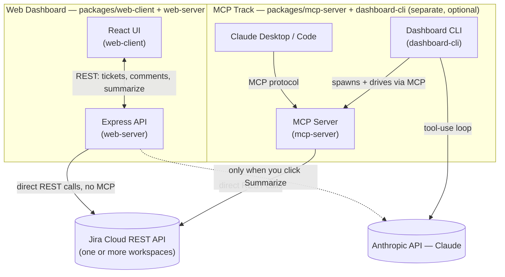

# jira-okr-dashboard-mcp

A Jira-over-MCP toolkit, built up in three stages:

1. **An MCP server** exposing Jira issues/progress as tools, for any MCP
   client (Claude Desktop, Claude Code, ...).
2. **A one-shot CLI** that drives Claude through those tools to write a
   static OKR status report.
3. **A live, multi-workspace web dashboard** — pull tickets from several
   Jira sites/teams into one view, filter by team or project label,
   comment on tickets without leaving the page, and get an AI-generated
   status summary of whatever you're currently looking at.

This is a clean-room, open-source rebuild of internal tools I built at
work — same ideas (AI-generated Jira visibility via MCP, Claude-assisted
status reporting), but every line here is new code written against my own
test Jira instance, with no proprietary code, data, or credentials
involved.

## Architecture — how the pieces fit together

Two tracks, one shared Jira brain underneath:

- **Visual track** (web dashboard) — you look at a table, filter it, click around.
- **Conversational track** (MCP) — you ask Claude a question and it goes and
  checks Jira for you, live in chat (or as a one-shot script for the CLI
  variant).

Both just call the same `JiraClient` in `packages/core` — they only differ
in how they present it, depending on whether you'd rather look or ask.
**The web dashboard never talks to MCP at all** — despite the repo's name,
MCP is only involved if you use the separate CLI/Claude-Desktop track.



- **Jira integration is always direct REST**, via the shared `JiraClient`
  in `packages/core` — both tracks use it, neither goes through the other.
- **An Anthropic API key is only needed for AI features specifically**:
  the web dashboard's Summarize button, or the CLI (which can't function
  without one, since writing the report *is* the CLI's job). Viewing
  tickets, filtering, and posting comments in the web dashboard need
  nothing but Jira credentials — zero LLM calls.
- **The MCP server is a separate, optional way to reach the same Jira
  data** from Claude Desktop or Claude Code, for people who want to ask
  Jira questions in a chat instead of a dashboard. Nothing in the web
  dashboard depends on it running.

## The web dashboard

The headline feature. As an engineering leader with a few teams, each
possibly living in a different Jira project or even a different Atlassian
site, this answers "what's actually going on across all of it" in one
screen — key, summary, assignee, due date, ETA, status, and the latest
comment, tagged by team and project label, with a comment box and an
AI summarize button.

```bash
npm install
cp config/workspaces.example.json config/workspaces.json
# edit config/workspaces.json — one entry per Jira site/team
cp .env.example .env
# fill in one JIRA_<NAME>_API_TOKEN per workspace, plus ANTHROPIC_API_KEY

npm run web-server    # terminal 1 — API on :4000
npm run web-client    # terminal 2 — UI on :5173
```

Want to see it working before touching a real Jira account? See
[`demo/README.md`](demo/README.md) — three fixture Jira servers, a
ready-made `config/workspaces.demo.json`, and instructions to run the
whole thing end to end against sample data (comment posting included).

**How a workspace config works:** each entry in `config/workspaces.json`
is one Jira site + a JQL scoping which issues belong on the dashboard,
tagged with a `team` label for the UI. Multiple workspaces can point at
the *same* Jira site (different projects, same team leader owning both)
or genuinely different Atlassian sites — the aggregator doesn't care
either way, it just fetches each one and tags the results:

```json
{
  "id": "team1-platform",
  "label": "Team 1 — Platform Engineering",
  "team": "Team 1",
  "baseUrl": "https://your-team.atlassian.net",
  "email": "you@example.com",
  "apiTokenEnvVar": "JIRA_TEAM1_API_TOKEN",
  "storyPointsField": "customfield_10016",
  "etaField": "customfield_10050",
  "jql": "project = PLAT AND resolution = Unresolved ORDER BY updated DESC"
}
```

Tokens are never stored in the config file itself — `apiTokenEnvVar` names
an environment variable that holds the real secret, so the config is safe
to share with your team or check into a private repo.

One workspace being down or misconfigured doesn't blank the dashboard —
see `Aggregator.fetchAllTickets` in `packages/web-server/src/aggregator.ts`:
failures are isolated per workspace and surfaced as a banner, while every
workspace that did respond still renders.

## Why MCP for the server/CLI half

The tools in `packages/mcp-server/src/tools/` don't know or care who's
calling them. Point Claude Desktop or Claude Code at
`packages/mcp-server/src/server.ts` and you get the same three tools
interactively, ask-a-question style, no dashboard needed:

- **`search_issues`** — run a JQL query, get back normalized issue summaries
- **`get_issue`** — fetch one issue by key
- **`get_okr_progress`** — run a JQL scoped to one OKR (an epic or a label)
  and compute completion by issue count, and by story points when every
  matched issue is estimated

`packages/dashboard-cli` is one more MCP client on top of that — useful
when you want a single static report to drop in Slack or a wiki page,
generated by an agentic loop where Claude decides which tools to call and
when it has enough to write the report:

```bash
cp .env.example .env
# fill in JIRA_BASE_URL, JIRA_EMAIL, JIRA_API_TOKEN, ANTHROPIC_API_KEY, OKR_JQL
npm run mcp-server   # for Claude Desktop/Code — see examples/claude_desktop_config.json
npm run dashboard     # one-shot: writes ./dashboard.html
```

Story points and ETA live in custom fields whose IDs vary per Jira
instance/plan — `JIRA_STORY_POINTS_FIELD` / `JIRA_ETA_FIELD` (single-
workspace) or each workspace's `storyPointsField`/`etaField`
(multi-workspace) let you point at the right one. Find yours via
`GET /rest/api/3/field` if a value you know is set keeps coming back null.

## Project layout

```
packages/
  core/                       Shared JiraClient, types, workspace config loader — everything else depends on this
    src/jira-client.ts         Jira Cloud REST client (native fetch, no deps)
    src/workspaces.ts          Multi-workspace config loading + validation
    src/adf.ts                 Atlassian Document Format <-> plain text (comments)
  mcp-server/                 MCP server: search_issues, get_issue, get_okr_progress
  dashboard-cli/               One-shot CLI: MCP client + Claude tool-use loop -> static dashboard.html
  web-server/                  Express API: multi-workspace aggregation, comment posting, AI summarize
    src/aggregator.ts           Parallel fetch across workspaces with per-workspace error isolation
    src/routes/                 tickets.ts, comments.ts, summarize.ts
  web-client/                  React + Vite dashboard UI
demo/
  mock-jira-server.mjs         Three fixture Jira sites (ports 4567-4569) — see demo/README.md
  workspaces.demo.json          Points config at the fixture servers
  try-tools.ts                  Exercises the MCP tools directly, no UI
config/
  workspaces.example.json       Template — copy to workspaces.json (gitignored) for your real teams
```

## Contributing

See [CONTRIBUTING.md](CONTRIBUTING.md) — setup, conventions, and what to
run before opening a PR. CI (`.github/workflows/ci.yml`) typechecks and
builds every package on each PR.

## Roadmap

- [ ] Tests around `getOkrProgress`'s points-vs-count logic and the diff/ADF helpers
- [ ] OAuth 2.0 (3LO) as an alternative to Jira API tokens
- [ ] Support object-typed ETA custom fields (e.g. a select list), not just string/date fields
- [ ] Persist the web dashboard's workspace fetch results (currently in-memory, refetched per request)
- [ ] Markdown rendering for the summarize panel instead of preformatted text
- [ ] Publish the MCP server as an installable package

## License

MIT — see [LICENSE](LICENSE).
